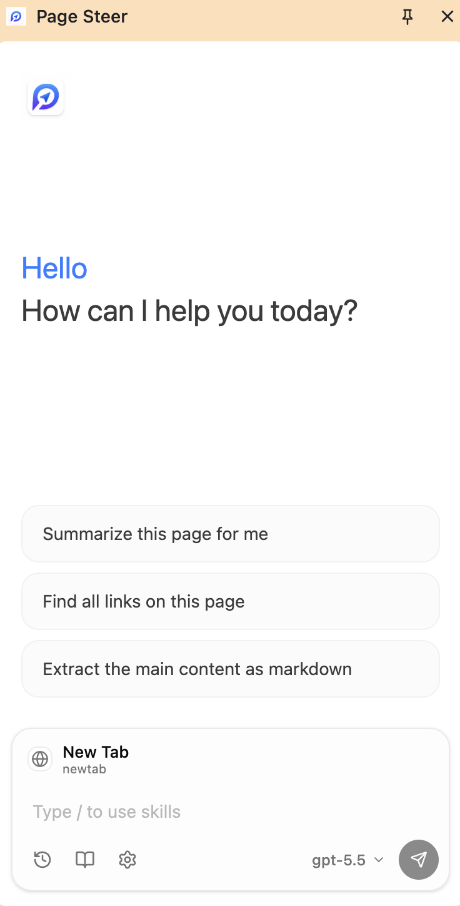
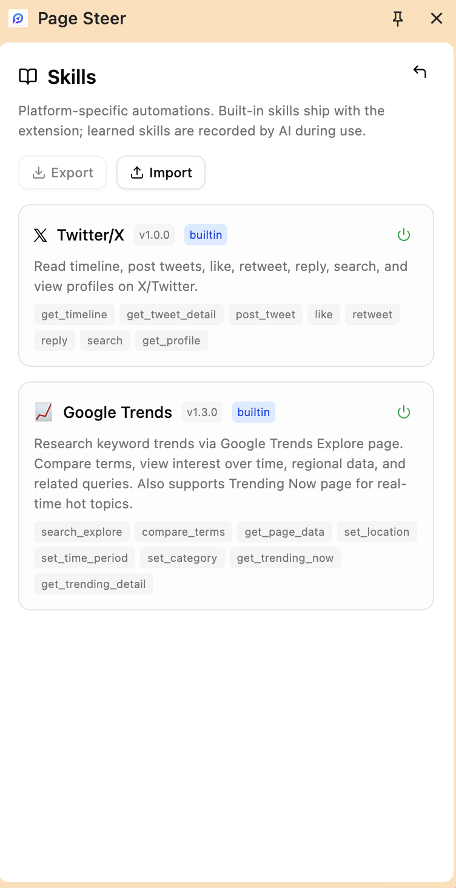

# Page Steer

[](https://opensource.org/licenses/MIT) [](http://www.typescriptlang.org/) [](https://github.com/cookiebody/PageSteer)

AI 驱动的浏览器助手——用自然语言操控任何 Web 界面，内置 Skill 系统实现平台级精准自动化。

🌐 [English](../README.md) | **中文**

<a href="https://cookiebody.github.io/docs/page-steer/" target="_blank"><b>📖 文档</b></a> | <a href="https://github.com/cookiebody/PageSteer" target="_blank"><b>💻 源码</b></a>

---

## ✨ Page Steer 是什么？

Page Steer 是一个浏览器扩展 + JS 库，让 AI 直接操作网页。它不需要截图猜测，而是读取实时 DOM、理解页面结构、执行精确操作。

<p align="center">
  
</p>

**核心差异：**

- **Skill 系统** — 平台专属的自动化方案（如 Twitter/X、Google Trends），跳过 DOM 猜测。Skill 使用稳定选择器（data-testid、aria-label），实现可靠且省 token 的自动化。
- **无需截图，无需视觉模型** — 纯文本 DOM 理解，兼容任何 LLM。
- **三种方式，同一个引擎** — Chrome 扩展（侧边栏对话）面向普通用户、MCP Server 接入 Cursor/Claude Desktop、或作为 JS 库嵌入你的应用。
- **从使用中学习** — AI 记录成功操作并回放为可复用 Skill，支持导入/导出共享。

## 🧩 Skill 系统

Skill 是平台专属的自动化方案，让 AI 拥有精确、可靠的操作能力，而不是每次都依赖 DOM 解析。

<p align="center">
  
</p>

```
┌─────────────────────────────────────────────┐
│  用户: "帮我发条推文说 hello world"            │
│                                             │
│  Agent 识别: x.com → twitter skill          │
│  Agent 调用: twitter_post_tweet({           │
│    text: "hello world"                      │
│  })                                         │
│                                             │
│  Skill 通过 data-testid 选择器执行           │
│  → 稳定、快速、无需 DOM 猜测                  │
└─────────────────────────────────────────────┘
```

### 三种 Skill 来源

| 来源     | 说明                                   |
| -------- | -------------------------------------- |
| **内置** | 随扩展发布（Twitter/X、Google Trends） |
| **学习** | AI 记录成功交互，保存为可复用方案      |
| **社区** | 导入/导出 Skill，通过项目仓库分享      |

### 内置 Skill

| Skill             | 操作                                                                                                                                             |
| ----------------- | ------------------------------------------------------------------------------------------------------------------------------------------------ |
| **Twitter/X**     | `get_timeline`、`post_tweet`、`like`、`retweet`、`reply`、`search`、`get_profile`、`get_tweet_detail`                                            |
| **Google Trends** | `search_explore`、`compare_terms`、`get_page_data`、`set_location`、`set_time_period`、`set_category`、`get_trending_now`、`get_trending_detail` |

Skill 面向稳定选择器（React `data-testid`、`aria-label`），实现可靠、CSP 安全的自动化。更多平台持续加入，也可自行编写。

## 🏗️ 架构

```
┌─────────────────────────────────────────────────────┐
│  Chrome Extension                                   │
│  ┌───────────┐  ┌──────────┐  ┌──────────────────┐ │
│  │ Sidepanel │  │   MCP    │  │   Background     │ │
│  │ (对话 UI) │  │  Server  │  │  (Skill 注册表   │ │
│  │  + 斜杠   │  │ (Native  │  │   + 执行器)      │ │
│  │   菜单    │  │  Host)   │  │                  │ │
│  └─────┬─────┘  └────┬─────┘  └────────┬─────────┘ │
│        │              │                  │           │
│        └──────────────┴──────────────────┘           │
│                       │                              │
│              PageSteerCore (Agent 循环)              │
│              ┌────────┴────────┐                     │
│              │  Skill Tools    │ ← 基于 URL          │
│              │  + DOM Tools    │   自动注入           │
│              └────────┬────────┘                     │
│                       │                              │
│              PageController (DOM 操作)               │
└───────────────────────┼──────────────────────────────┘
                        │
                   目标标签页
```

### Monorepo 包结构

| 包                            | 用途                             |
| ----------------------------- | -------------------------------- |
| `@page-steer/page-controller` | DOM 提取 + 视觉反馈              |
| `@page-steer/llms`            | LLM 客户端（带反思后行动机制）   |
| `@page-steer/core`            | 无头 Agent 核心                  |
| `@page-steer/ui`              | 面板 UI + 国际化                 |
| `page-steer`                  | 主入口，带 UI（JS 库）           |
| `packages/mcp`                | MCP Server，供外部 AI 客户端调用 |
| `packages/extension`          | Chrome 扩展（WXT + React）       |

## 🚀 快速开始

### Chrome 扩展

1. 克隆并构建：

```bash
git clone https://github.com/cookiebody/PageSteer.git
cd page-steer
npm install
npm run build:ext
```

2. 在 Chrome 中加载：
    - 打开 `chrome://extensions`
    - 开启开发者模式
    - 点击「加载已解压的扩展程序」→ 选择 `packages/extension/.output/chrome-mv3`

3. 打开侧边栏，配置你的 LLM 端点，开始对话。

### MCP Server（Cursor / Claude Desktop）

```bash
cd packages/mcp
node src/install.js
```

然后添加到你的 MCP 客户端配置。详见 [MCP 文档](../packages/mcp/README.md)。

### JS 库（嵌入你的应用）

```bash
npm install page-steer
```

```javascript
import { PageSteer } from 'page-steer'

const agent = new PageSteer({
    model: 'your-model',
    baseURL: 'https://your-api-endpoint/v1',
    apiKey: 'YOUR_API_KEY',
})

await agent.execute('填写联系表单并提交')
```

## 💡 应用场景

- **浏览器自动化** — "帮我看看 timeline" / "发条推文" / "搜索 AI agents"
- **SaaS AI 副驾驶** — 嵌入你的产品，几行代码上线 AI Copilot
- **智能表单填写** — 20 次点击变成一句话
- **多标签页操作** — Agent 通过扩展跨标签页工作
- **MCP 集成** — 让 Cursor/Claude Desktop 控制你的浏览器

## 🛠️ 开发

```bash
npm run dev:ext         # 扩展开发模式
npm run dev:demo        # Demo 开发服务器
npm run build           # 构建所有包
npm run build:ext       # 构建 + 打包扩展
npm run typecheck       # 类型检查
npm run test            # 运行测试
```

## 🤝 贡献

欢迎社区贡献！请参阅 [CONTRIBUTING.md](../CONTRIBUTING.md) 了解贡献指南。

## ⚖️ 许可证

[MIT License](../LICENSE)

## 👏 致谢

DOM 处理组件源自 [browser-use](https://github.com/browser-use/browser-use)（MIT License, Copyright (c) 2024 Gregor Zunic）。

---

**⭐ 如果觉得 Page Steer 有用，请给项目点个星！**
